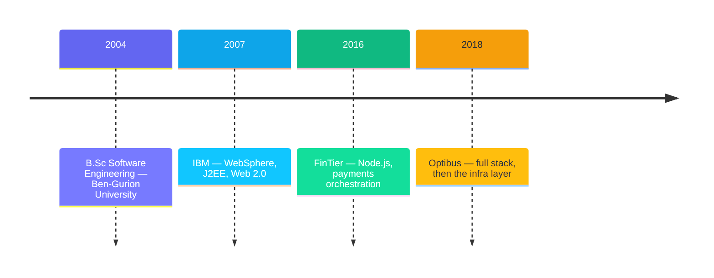

# Lior Solomon 👋

> [!IMPORTANT]
> **Senior full-stack developer & infra/DevOps at [Optibus](https://www.optibus.com/) since 2018.**
> I own the infrastructure layer of a production public-transport planning platform — AWS (EKS,
> Karpenter), MongoDB Atlas, RDS/Aurora — and three CI systems running in parallel: Jenkins,
> CircleCI and GitHub Actions.

## ⚡ What I actually do

- 🧯 Front-line infra support — and when it's a P1, the RCA afterwards
- ⬆️ Platform upgrade sweeps across EKS, Karpenter and Atlas
- 🗜️ Atlas storage and compaction operations
- 💸 FinOps — finding the cost and taking it out
- 🧰 Author of the Jenkins pipeline framework the teams build on; CircleCI and GitHub Actions alongside
- 🧭 Codebase-wide migrations, owned end to end
- 🤖 Agent tooling org-wide — Claude Code skills and internal MCP servers

> [!TIP]
> **Now:** rolling out agent tooling across the engineering org — Claude Code skills, internal
> MCP servers, multi-agent workflows that ship real code.

## 🛤️ The road here

- 🏦 **FinTier** — Senior Full-Stack Developer, 2016–2018. Node.js, MongoDB and RabbitMQ behind a
  React/Redux front end. On Swifti, orchestrated payment transactions across banks, M-Pesa, AML,
  ID verification and Braintree, on Spring Boot and Postgres.
- 🔵 **IBM** — Software Engineer, 2007–2016. Joined as a student and stayed nine years: a SIP
  presence server and a J2EE messaging platform (EJB, JPA, REST) on WebSphere Application Server,
  Web 2.0 tooling under WebSphere Portal, and hybrid mobile on Worklight. Named on the patent
  publication *Method and system for automatic emergency team building*.
- 🎓 **Ben-Gurion University of the Negev** — B.Sc Software Engineering, 2004–2008.

## 🧰 What I work with

- ☁️ **Cloud & platform** — AWS · EKS · Karpenter · Cloudflare Workers, Pages, D1
- 🗄️ **Data** — MongoDB Atlas · RDS/Aurora · PostgreSQL
- 🔁 **CI/CD** — Jenkins (framework author) · CircleCI · GitHub Actions
- 💬 **Languages** — JavaScript · TypeScript · Groovy · Bash · SQL · Python

> [!WARNING]
> House rule: assume a platform upgrade is always in flight. Never assume a version — check.

> [!NOTE]
> 📍 Israel · [LinkedIn](https://www.linkedin.com/in/liorsol) · lior@liorsolomon.com

---

## 🗂️ This repo

`liorsol/liorsol` is both this profile page and the source of
**[liorsol.github.io/liorsol](https://liorsol.github.io/liorsol/)** — a personal static site
served by GitHub Pages straight from `main`. No build step, no dependencies: every page is plain
HTML/CSS/JS and opens from disk. Media lives in a second repo,
[`liorsol/assets`](https://github.com/liorsol/assets), to keep the binaries out of here while
staying same-origin with the site.

A few things that live in it:

- 🗺️ **[Trip pages](trips/)** — Hebrew RTL single-page apps with deep links, a vendored Leaflet map,
  shared comment boards on Firebase, and an installable PWA that works with no reception.
- 📶 **[eSIM usage](esim-usage/)** — data-usage bars for the family's eSIMs, behind a Cloudflare Worker proxy.
- 📈 **[Savings calculator](savings-calculator.html)** — monthly portfolio simulator with fees, capital-gains tax and inflation indexation.
- 🔌 **[Car charging](car-charging/)** — EV charging dashboard on Cloudflare Workers + D1.
- ✏️ **[`edit-server.mjs`](edit-server.mjs)** — a dependency-free local server that makes a page's prose
  editable in the browser and writes each edit straight back into the HTML on disk.

**How it all works: [`docs/README.md`](docs/README.md).** Architecture, the shared service worker,
the Firebase security rules, the Cloudflare Worker quota rules, local development and the
in-browser editor.
